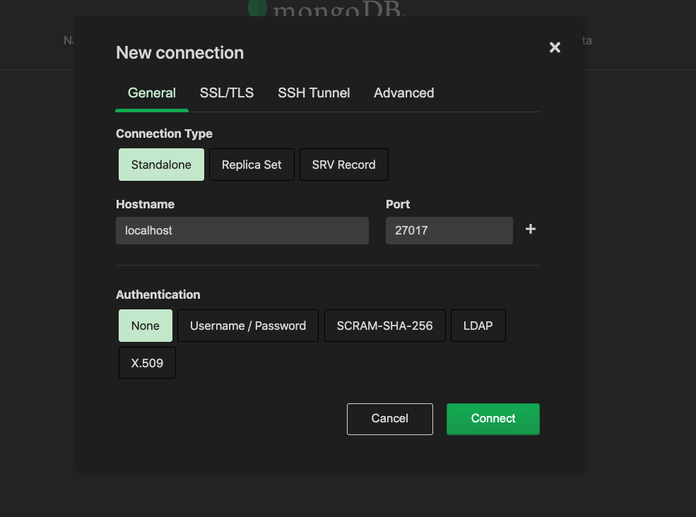
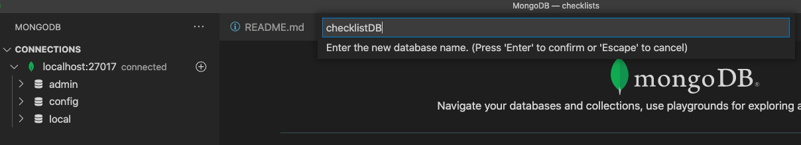

# Checklist 시스템 개발 with GRPC

## VSCode extension 설치. 

VSCode 에서 아래 2개의 익스텐션을 설치해준다. 

- vscode-proto3
- Clang-Format

## ClangFormat 설치 

```go
brew install clang-format
```

## protobuf 설치하기. 

```go
brew instal protobuf
```

## go 모듈 생성

```go
go mod init github.com/schooldevops/go/grpc/checklist
```

### grpc go module 설치

```go
go get -u google.golang.org/grpc

go get -u github.com/golang/protobuf/protoc-gen-go

go get -u google.golang.org/grpc/cmd/protoc-gen-go-grpc

```

### google/api/annotations.proto 설치

```go
mkdir -p google/api    
curl https://raw.githubusercontent.com/googleapis/googleapis/master/google/api/annotations.proto > google/api/annotations.proto     
curl https://raw.githubusercontent.com/googleapis/googleapis/master/google/api/http.proto > google/api/http.proto
```

#### grpc api gateway 의존성 get 

```go
go get google.golang.org/protobuf/encoding/protojson

go get "github.com/grpc-ecosystem/grpc-gateway/v2/protoc-gen-grpc-gateway"

go get "github.com/grpc-ecosystem/grpc-gateway/v2/protoc-gen-openapiv2"

go get -u github.com/grpc-ecosystem/grpc-gateway/protoc-gen-swagger


```

or 

```go
go install \
    github.com/grpc-ecosystem/grpc-gateway/v2/protoc-gen-grpc-gateway \
    github.com/grpc-ecosystem/grpc-gateway/v2/protoc-gen-openapiv2 \
    google.golang.org/protobuf/cmd/protoc-gen-go \
    google.golang.org/grpc/cmd/protoc-gen-go-grpc
```


### mongo docker 설치 및 실행 

```go
docker run --name mongo-local -v ${PWD}/data/mongo/db:/etc/mongo -d  -p 27017:27017 mongo
```

```go
lsof -PiTCP -sTCP:LISTEN 

com.docke 2416 kido   89u  IPv6 0x3aae8b1e628abd9      0t0  TCP *:27017 (LISTEN)
...
``` 

을 통해서 27017 포트를 확인한다. 

### MONGO Client Extension 을 VSCode 에 설치

[MongoDB for VS Code](https://marketplace.visualstudio.com/items?itemName=mongodb.mongodb-vscode) 를 설치 

mongoDB 에 다음과 같은 과정으로 접근하고 DB 및 Collection 을 생성한다. 








### protobuf 정의하기. 

체크리스트를 protobuf 파일을 정의하기 위해서 다음과 같이 코드를 수정한다. 

checkpb/check.proto 파일을 다음과 같이 작성한다. 

```proto

```


curl -X POST -k http://localhost:50005/v1/checklist -d '{"channel": "CoreOS is hiring!"}'

### MongoDB

#### Query

```go
db.getCollectionNames();

db.getCollectionInfos();

db.checklist.getIndexes();

db.checklist.find();

db.checklist.findOne({ category: { $eq: 'Security' } });

db.checklist.findOne({ category: 'Security'});

db.checklist.findOne({ order: {$lt: 10} });

db.checklist.find({ order: {$lt: 10}, channel: 'Architecture' });
```


## 참고자료

- protojson: https://seb-nyberg.medium.com/customizing-protobuf-json-serialization-in-golang-6c58b5890356
- grpc gateway: https://github.com/grpc-ecosystem/grpc-gateway
- grpc call using json: https://www.c-sharpcorner.com/article/using-grpc-gateway-to-call-grpc-service-via-restful-json-api/
- grpc rest: https://grpc.io/blog/coreos/
- grpc rest: https://blog.csnet.me/blog/building-a-go-api-grpc-rest-and-openapi-swagger.1/
- grpc rest sample: https://github.com/philips/grpc-gateway-example
 